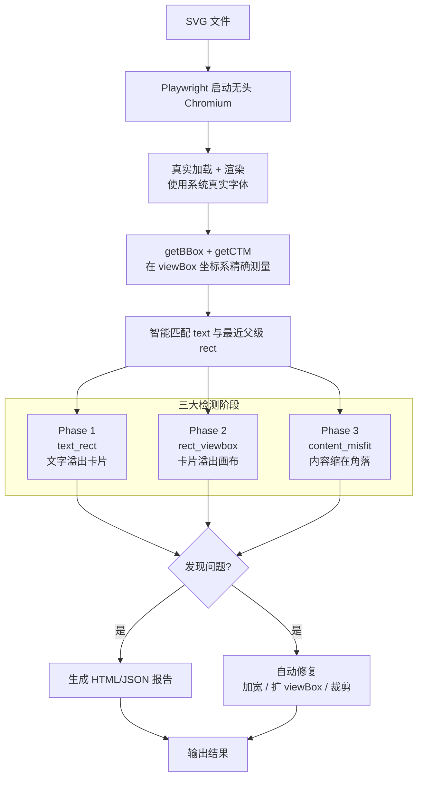

# 🛡️ svg-guard

**自动检测并一键修复 SVG 图表中的文本溢出问题**

> 专为技术文档、教材、流程图、架构图、infographics 设计。  
> 再也不用手动调整坐标、猜测文字宽度了！

当 SVG 使用硬编码绝对坐标时（这是 draw.io、Figma、Visio 或手写 SVG 的常见做法），文字经常会溢出卡片框、被裁剪，或者整个图形“缩在画布一角、下面全是空白”。  
尤其是**中文、日文、韩文**，因为字体宽度差异大，在不同平台渲染结果不同，问题更加严重。

**svg-guard** 的核心理念：**用真实浏览器渲染 + 精确测量**，而不是猜宽度或字符串长度。

---

## ✨ 核心特性（为什么值得使用）

| 特性 | 说明 | 新手收益 |
|------|------|----------|
| **真实浏览器渲染** | 使用 Playwright + Chromium 真实渲染 SVG | 检测结果与最终用户看到的完全一致 |
| **三大阶段检测** | 同时抓住 text→rect、rect→viewBox、content_misfit 三类问题 | 覆盖 95% 以上常见溢出场景 |
| **自动修复** | 一键加宽卡片、扩展画布、或智能裁剪 viewBox | 省去手动调参的痛苦 |
| **精美可视化报告** | 自包含 HTML，红色高亮框 + hover 联动 | 问题一目了然，定位飞快 |
| **CI 友好** | 非 0 退出码 + JSON 输出 | 轻松接入 GitHub Actions / GitLab CI |
| **安全备份** | 修复前自动生成 `.svg.bak` | 放心大胆使用 |
| **Python API** | 提供 `check_svg`、`fix_svg`、`check_directory` | 集成到自己的工具链 |

---

## 🖼️ 效果对比（真实案例）


*左侧：文字溢出卡片框（真实渲染后被裁剪）*<br>
*右侧：svg-guard 自动加宽卡片，文字完美适配*

---

## 🚀 新手 5 分钟快速上手

### 步骤 1：安装（只需一次）

```bash
pip install svg-guard
playwright install chromium
```

> **提示**：`playwright install chromium` 会下载约 150MB 的浏览器内核，首次需要网络。

### 步骤 2：准备你的 SVG 文件

把所有需要检查的 `.svg` 文件放到一个文件夹，例如：

```
my-project/
├── diagrams/
│   ├── architecture.svg
│   ├── flowchart.svg
│   └── user-flow.svg
└── ...
```

### 步骤 3：一键检查 + 生成报告（推荐新手先做这一步）

```bash
cd my-project
svg-guard check --dir ./diagrams --html report.html --verbose
```

运行完成后会生成 `report.html`，**双击打开**即可看到：


**报告亮点**：
- 左侧真实渲染的 SVG
- **红色半透明框** 精确标出溢出区域和父级 rect
- 右侧问题列表（支持 hover 高亮对应红框）
- 支持 Light / Dark 模式

### 步骤 4：一键自动修复

确认报告没问题后：

```bash
svg-guard fix --dir ./diagrams
```

- 所有问题都会被自动修复
- 原始文件自动备份为 `xxx.svg.bak`
- 想预览不实际修改？加 `--dry-run`

---

## 🧠 工作原理（图解流程）



**为什么必须用真实浏览器？**

- 文字宽度受字体、字号、字重、字间距、浏览器引擎影响极大
- CJK 文字尤其“任性”
- SVG 可能有 `<text>` 嵌套 transform、rotate、nested `<svg>` 等复杂情况
- 启发式（估算宽度）经常漏报或误报

svg-guard 用 `getBBox()` + `getCTM()` 在 **viewBox 用户坐标系** 下测量，结果与最终渲染像素无关，稳定可靠。

---

## 🔍 三大检测阶段详解

### 1. Phase 1: `text_rect` —— 文字溢出它的卡片框（最常见）

**典型场景**：流程图、卡片式架构图中，中文标题比预留的 rect 宽。

**检测逻辑**：
- 找到每个 `<text>` 的最近父级 `<rect>`
- 比较 text 的实际边界与 rect 边界（支持 `pad`、`edge_pad`、`vpad` 容差）
- 超过阈值 → 标记 `text_rect`

**修复方式**：自动增加 rect 的 `width` / `height`（额外加 `fix_pad` 留白）

### 2. Phase 2: `rect_viewbox` —— 卡片框本身超出了 SVG 画布

**典型场景**：rect 的 x/y/width/height 让它跑到 viewBox 外面，导致部分内容被裁剪。

**修复方式**：自动扩展根 `<svg>` 的 `viewBox`、`width`、`height`

### 3. Phase 3: `content_misfit` —— “内容缩在角落 + 大片空白”（最隐蔽）

**典型场景**：
- 很多工具导出的 SVG viewBox 是 `0 0 1920 1080`，但实际内容只占 10% 面积
- 内容偏在左上角，打开后感觉“图好小，下面全是白”

**检测逻辑**（同时满足两个条件）：
- 内容覆盖率 < `coverage_threshold`（默认 0.5）
- 内容质心偏离画布中心超过 `center_offset_threshold`

**修复方式**：智能裁剪 viewBox 到内容周围（加 `crop_pad` 留白），让图形居中且充满画面。

> **小技巧**：想完全关闭 Phase 3？设置 `coverage_threshold=0`

---

## ⚙️ DetectionConfig 完整参数表（新手友好版）

所有长度单位都是 **SVG 内部的 user units（viewBox 坐标）**，不受浏览器窗口大小影响。

| 参数 | 默认值 | 阶段 | 作用说明 | 新手建议 |
|------|--------|------|----------|----------|
| `pad` | 3.0 | 1 | 文字允许超出 rect 的基础容差 | 想更严格 → 改成 1.0~2.0 |
| `edge_pad` | 4.0 | 1 | 右侧/底部额外容差（文字最容易溢出处） | 保持默认 |
| `vpad` | 2.0 | 1 | 垂直方向容差（处理 descender） | 保持默认 |
| `fix_pad` | 2.0 | 1 | 修复时额外增加的留白 | 想紧一点 → 改 1.0 |
| `min_rect_w` / `min_rect_h` | 80 / 40 | 1 | 小于此尺寸的 rect 忽略（装饰性小圆点等） | 想检查小卡片 → 改小到 30/20 |
| `vbox_fix_pad` | 4.0 | 2 | 扩展 viewBox 时的额外留白 | 保持默认 |
| `coverage_threshold` | 0.5 | 3 | 内容覆盖率低于此值才可能触发 misfit | 想更敏感 → 改 0.3 |
| `center_offset_threshold` | 0.5 | 3 | 内容质心偏离中心超过此值 | 保持默认 |
| `bg_rect_ratio` | 0.9 | 3 | 大于此比例的 rect 视为背景，不参与内容 bbox 计算 | 保持默认 |
| `crop_pad` | 8.0 | 3 | 裁剪 viewBox 时周围留白 | 想边缘更紧 → 改 4.0 |
| `viewport_w` / `viewport_h` | 1600 / 1200 | 渲染 | 浏览器渲染视口大小 | 一般不需要改 |

**使用自定义配置示例**：

```python
from svg_guard import DetectionConfig, BrowserRunner, check_directory

cfg = DetectionConfig(
    pad=1.5,
    min_rect_w=40,
    min_rect_h=30,
    coverage_threshold=0.35,
)

with BrowserRunner(cfg) as runner:
    results, total = check_directory("./diagrams", runner=runner)
```

---

## 🖥️ CLI 完整命令参考

### `svg-guard check` —— 检测模式（推荐先运行）

```bash
svg-guard check --dir ./diagrams --verbose --html report.html --json report.json
```

| 参数 | 默认 | 说明 |
|------|------|------|
| `--dir` | `.` | 要扫描的目录 |
| `--verbose`, `-v` | 关闭 | 显示每个文件的详细检测过程 |
| `--html FILE` | — | 生成自包含可视化 HTML 报告 |
| `--json FILE` | — | 生成结构化 JSON 结果（方便后续处理） |

退出码：**0** = 全部正常，**1** = 发现问题（适合 CI）

### `svg-guard fix` —— 自动修复模式

```bash
svg-guard fix --dir ./diagrams --dry-run   # 预览不修改
svg-guard fix --dir ./diagrams             # 真正修复（自动备份）
```

| 参数 | 默认 | 说明 |
|------|------|------|
| `--dry-run` | 关闭 | 只显示会修改什么，不实际写入 |
| `--no-backup` | 关闭 | 跳过 `.bak` 备份（不推荐） |

### `svg-guard report` —— 一键生成报告

```bash
svg-guard report --dir ./diagrams --output my-report.html
```

等价于 `check + 生成 HTML`，适合快速分享给团队。

---

## 🐍 Python API 使用示例

### 基础用法

```python
from pathlib import Path
from svg_guard import BrowserRunner, check_svg, fix_svg

with BrowserRunner() as runner:
    result = check_svg(runner.page, Path("diagrams/arch.svg"))
    
    if result.ok:
        print("✅ 没有发现问题")
    else:
        print(f"❌ 发现 {len(result.issues)} 个问题")
        changes = fix_svg(Path("diagrams/arch.svg"), result.issues)
        for c in changes:
            print(f"  已修复: {c}")
```

### 批量处理多个目录（复用浏览器实例，速度更快）

```python
from svg_guard import check_directory

with BrowserRunner() as runner:
    for folder in ["./diagrams", "./icons", "./assets"]:
        results, total_files = check_directory(folder, runner=runner)
        print(f"{folder}: {total_files} 个文件处理完成")
```

---

## 🧩 CI/CD 集成示例（GitHub Actions）

```yaml
name: SVG Guard Check
on: [push, pull_request]

jobs:
  svg-check:
    runs-on: ubuntu-latest
    steps:
      - uses: actions/checkout@v4
      - name: Setup Python
        uses: actions/setup-python@v5
        with:
          python-version: "3.11"
      - name: Install svg-guard
        run: |
          pip install svg-guard
          playwright install chromium
          # 安装中文字体（关键！）
          sudo apt-get update && sudo apt-get install -y fonts-wqy-zenhei fonts-noto-cjk
      - name: Run svg-guard check
        run: svg-guard check --dir ./docs/images --html report.html
      - name: Upload report
        uses: actions/upload-artifact@v4
        if: always()
        with:
          name: svg-guard-report
          path: report.html
```

> **重要**：CI 环境通常没有中文字体，必须显式安装，否则中文检测会不准确。

---

## ❓ 常见问题 FAQ

**Q1: 报告里中文显示为方框/乱码？**  
A: CI 或服务器缺少中文字体。请安装 `fonts-wqy-zenhei`、`fonts-noto-cjk` 或 `fonts-noto-cjk-extra`。

**Q2: 想忽略某些 SVG 文件？**  
A: 目前可通过目录结构隔离，或在脚本中自己过滤文件名。未来版本会支持 `.svgguardignore`。

**Q3: 支持带 `<defs>`、`<use>`、复杂 transform 的 SVG 吗？**  
A: 支持！因为使用真实 `getCTM()` 累积所有变换矩阵。

**Q4: 修复后的 SVG 格式会乱吗？**  
A: 不会。工具会尽量保留原有缩进、属性顺序和格式。

**Q5: 可以只检测不修复吗？**  
A: 可以！直接用 `check` 命令，或 `fix --dry-run`。

**Q6: 检测速度慢？**  
A: 首次启动 Chromium 较慢，后续复用同一个 `BrowserRunner` 实例会快很多。批量处理推荐传递同一个 runner。

---

## 📚 进阶建议

1. **新手第一次使用**：先只跑 `check --html report.html`，看报告确认没误报再执行 `fix`。
2. **团队规范**：把 `svg-guard check` 加入 pre-commit hook 或 CI 必检项。
3. **自定义阈值**：根据项目特点调整 `pad` 和 `min_rect_*`，避免过度严格或漏报。
4. **贡献示例**：欢迎向仓库提交你项目中遇到的典型溢出 SVG（脱敏后），帮助改进检测算法。

---

## 🤝 贡献 & 反馈

- 提交 Issue：描述你的 SVG 场景 + 截图
- 提交 PR：欢迎改进检测逻辑、增加更多 Phase、优化报告 UI
- Star 支持：如果这个工具帮到你，请给原仓库一个 Star！

---

## 📄 License

MIT License

---

**让每张 SVG 都清晰、专业、无溢出！**  
svg-guard —— 你的 SVG 质量守护者 🛡️

> 本 README 为增强版，相比原版增加了大量图解、 Mermaid 流程图、新手步骤、参数中文解释和实际效果示意图。欢迎使用！