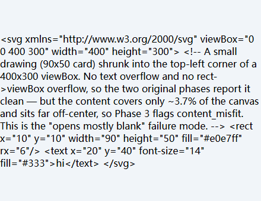
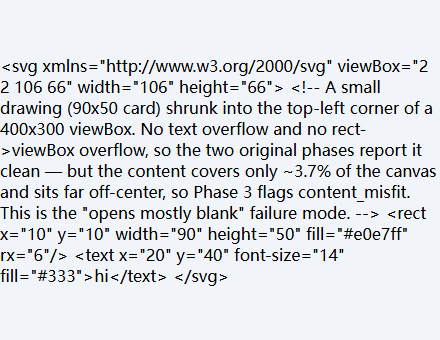

# svg-guard

Detect and auto-fix text overflow in SVG diagrams.

When SVG diagrams use hardcoded absolute coordinates — common in technical documentation, textbooks, and infographics — text frequently overflows its container boxes. This is especially painful with CJK characters, where rendered width varies by font and platform. **svg-guard** renders each SVG in a real browser, measures every `<text>` element against its parent `<rect>`, and reports (or fixes) any overflow.

## Features

- **Accurate detection** — uses Chromium via Playwright for real rendering measurements, not heuristic estimates
- **Three-phase check** — catches text→rect overflow, rect→viewBox overflow, *and* "content shrunk into a corner" (a drawing that opens mostly blank because its viewBox dwarfs the actual content)
- **Auto-fix** — widens cards, expands viewBox to resolve overflow, and crops the viewBox when content is off-center and sparse
- **HTML report** — generates a self-contained visual report: each problem file shows its **rendered SVG with red-box overlays** marking every overflow region (plus the parent rect), cross-highlighted with the issue list on hover
- **CI-friendly** — exits with code 1 on issues; supports JSON and HTML output
- **Backup-safe** — creates `.bak` files before any fix

## Install

```bash
pip install svg-guard
playwright install chromium
```

Requires Python 3.10+.

## Quick Start

```bash
# Check all SVGs in current directory
svg-guard check --dir ./images --verbose

# Check and generate HTML + JSON reports
svg-guard check --dir ./images --json report.json --html report.html

# Auto-fix detected issues
svg-guard fix --dir ./images

# Preview fixes without writing
svg-guard fix --dir ./images --dry-run
```

## CLI Reference

### `svg-guard check`

Detect overflow issues in SVG files.

| Flag | Default | Description |
|------|---------|-------------|
| `--dir` | `.` | Directory containing SVG files |
| `--verbose`, `-v` | off | Show per-file details |
| `--json FILE` | — | Write JSON report |
| `--html FILE` | — | Write HTML visual report |

Exit code: **0** if no issues, **1** if any overflow detected.

### `svg-guard fix`

Auto-fix detected overflow issues.

| Flag | Default | Description |
|------|---------|-------------|
| `--dir` | `.` | Directory containing SVG files |
| `--dry-run` | off | Show what would change without modifying files |
| `--no-backup` | off | Skip creating `.svg.bak` backup files |

### `svg-guard report`

Check every SVG in the directory and render the results as a self-contained
HTML report (runs the full check, then writes the report).

| Flag | Default | Description |
|------|---------|-------------|
| `--dir` | `.` | Directory containing SVG files |
| `--output`, `-o` | `svg-guard-report.html` | Output HTML path |

## Programmatic API

```python
from pathlib import Path
from svg_guard import BrowserRunner, DetectionConfig, check_svg, fix_svg

# Check a single file, reusing one browser for many operations
with BrowserRunner() as runner:
    result = check_svg(runner.page, Path("diagram.svg"))
    print(f"{'OK' if result.ok else 'ISSUES'}: {len(result.issues)} found")

    # Auto-fix
    if not result.ok:
        changes = fix_svg(Path("diagram.svg"), result.issues)
        for change in changes:
            print(f"  Fixed: {change}")

# Batch check a directory — pass the same runner to skip re-launching Chromium
from svg_guard import check_directory
with BrowserRunner() as runner:
    for d in ("./images", "./icons"):
        results, total = check_directory(d, runner=runner)
```

`BrowserRunner` accepts a `DetectionConfig` to tune thresholds and viewport:

```python
cfg = DetectionConfig(pad=1.0, viewport_w=2000)  # stricter, wider canvas
with BrowserRunner(cfg) as runner:
    ...
```

**Library use is silent by default.** Progress output goes through Python's
`logging` (logger name `"svg_guard"`); the CLI attaches a handler so users
see progress, but `import svg_guard` alone prints nothing. Add a handler if
you want logs in your own tool.

### `DetectionConfig` reference

Every detection threshold lives on `DetectionConfig`. All lengths are in the
SVG's own **user units** (viewBox space), not CSS pixels — so they don't change
when the browser window is resized. Construct it with any subset of keyword
args; omitted fields keep their defaults.

| Field | Default | Phase | Description |
|-------|---------|-------|-------------|
| `pad` | `3.0` | 1 | Extra slack (user units) a `<text>` is allowed to extend beyond its parent rect before flagging `text_rect` |
| `edge_pad` | `4.0` | 1 | Additional slack applied at the rect's right/bottom edge (where text typically clips) |
| `vpad` | `2.0` | 1 | Vertical slack for the text baseline / descender area |
| `fix_pad` | `2.0` | 1 | Extra width/height added when widening a rect in a fix, so the text isn't flush against the edge |
| `min_rect_w` | `80.0` | 1 | Rects narrower than this are ignored as parent containers (decorative dots, dividers) |
| `min_rect_h` | `40.0` | 1 | Rects shorter than this are ignored as parent containers |
| `vbox_fix_pad` | `4.0` | 2 | Extra slack added when expanding the viewBox in a `rect_viewbox`/`text_viewbox` fix |
| `coverage_threshold` | `0.5` | 3 | Flag `content_misfit` when content covers **less than** this fraction of the viewBox area (combined with `center_offset_threshold` via AND) |
| `center_offset_threshold` | `0.5` | 3 | Flag when the content centroid is farther from the viewBox center than this (normalized: `0` = dead center, `~1` = flush to an edge). Set `coverage_threshold=0` to disable Phase 3 entirely |
| `bg_rect_ratio` | `0.9` | 3 | A rect spanning at least this fraction of the viewBox on **both** axes is treated as a background fill and excluded from the content bbox (so a full-canvas background doesn't mask genuinely tiny content) |
| `crop_pad` | `8.0` | 3 | Padding (user units) left around content when computing the crop viewBox for a `content_misfit` fix, so edge strokes aren't shaved off |
| `viewport_w` | `1600` | render | Browser viewport width for rendering |
| `viewport_h` | `1200` | render | Browser viewport height for rendering |

## How It Works

1. **Render** — Each SVG is loaded into a headless Chromium page via Playwright
2. **Measure** — `getBBox()` + `getCTM()` give each element's bounds in the SVG's own user units (viewBox space), correctly accumulating transforms like `rotate` and nested `<svg>`. This is viewport-independent: results don't shift when the browser window is resized.
3. **Associate** — Each text element is matched to its nearest parent rect by center-point containment
4. **Detect** — Three phases:
   - **Phase 1**: text extends beyond its parent rect → `text_rect` issue
   - **Phase 2**: rect extends beyond the SVG viewBox → `rect_viewbox` issue
   - **Phase 3**: visible content occupies a small, off-center slice of the viewBox (the "opens mostly blank, drawing shrunk into a corner" failure mode that Phases 1–2 are blind to) → `content_misfit` issue
5. **Fix** — For each issue, the SVG source is patched (preserving formatting):
   - ViewBox overflow → increases `viewBox` dimensions (and the root `<svg>` width/height)
   - Card overflow → increases the rect's `width`/`height` attributes
   - Content misfit → crops the `viewBox` (and root width/height) to a tight box around the visible content

### Tuning detection

All thresholds live in `DetectionConfig` (in user units, not CSS pixels) and can be passed to `check_svg` / `check_directory`:

```python
from svg_guard import DetectionConfig, check_svg

# Stricter: flag text that's even slightly snug, consider small rects too
cfg = DetectionConfig(pad=1.0, min_rect_w=20.0, min_rect_h=20.0)
result = check_svg(page, Path("diagram.svg"), config=cfg)
```

Phase 3 (`content_misfit`) has its own knobs. A drawing is flagged only when
its content covers **less than** `coverage_threshold` of the viewBox area **and**
is off-center by more than `center_offset_threshold` (both must hold, so a
legitimately sparse-but-centered layout stays clean). `bg_rect_ratio` lets a
full-canvas background rect be ignored when measuring content coverage.

```python
# Catch content that covers <40% of the canvas while off-center; ignore
# background rects spanning 95%+ of the viewBox.
cfg = DetectionConfig(
    coverage_threshold=0.4,
    center_offset_threshold=0.5,
    bg_rect_ratio=0.95,
)
```

### Limitations

- **Left/top text overflow is reported but not auto-fixed.** Widening a rect grows it toward the bottom-right, so it can never cover text that starts *before* the rect's left/top edge; auto-fixing would loop forever re-expanding. Such issues are flagged `fixable=false` and the fixer skips them with a clear message — move the text manually.
- **Content misfit is measured by axis-aligned bounding box.** Phase 3 unions every drawable element's bbox (rect/text/path/circle/…) and compares that against the viewBox. A layout that genuinely *intends* a lot of empty space with a centered focal element won't trigger it (the AND of low-coverage *and* off-center guards that), but a sparse, off-center decorative composition could. Tune `coverage_threshold`/`center_offset_threshold` or set the former to `0` to disable the phase entirely.
- **Rotated elements** are measured by their axis-aligned bounding box in viewBox space (transforms are correctly accumulated via `getCTM`). Exact rotated-region containment (a rotated rect with text rotated differently) is approximated, not polygon-precise.
- **CJK fonts in CI**: headless Chromium on a Linux runner has no CJK fonts by default, so Chinese/Japanese text may measure differently than on your machine. Install a CJK font (`fonts-noto-cjk` on Debian/Ubuntu) in CI for consistent results.

## Why Not Heuristics?

SVG text rendering depends on the actual font, kerning, ligatures, and CSS. A 16px Chinese character might render as 14px or 18px depending on the font. The only reliable way to detect overflow is to render and measure — which is exactly what svg-guard does.

## Example: detecting `content_misfit`

Some SVGs open "mostly blank" — the viewBox is far larger than the drawing, which is shrunk into a corner. The original two-phase check misses this: the text fits its rect, and the rect fits the viewBox, so neither overflow fires. **Phase 3** catches it by measuring how much of the canvas the content actually fills *and* whether it's off-center (both must hold, so a deliberately sparse-but-centered layout is left alone).

Take this SVG — a small card with the text "hi", drawn in the top-left corner of a 400×300 canvas:

```svg
<svg xmlns="http://www.w3.org/2000/svg" viewBox="0 0 400 300" width="400" height="300">
  <rect x="10" y="10" width="90" height="50" fill="#e0e7ff" rx="6"/>
  <text x="20" y="40" font-size="14" fill="#333">hi</text>
</svg>
```

The content covers only **~3.7%** of the viewBox and sits far off-center (offset ≈ 0.78), so `check` flags it:

```
content_misfit: content 90x50 in 400x300 viewBox  (viewbox+oversized)
```

`fix` then crops the viewBox to a tight box around the content (viewBox `0 0 400 300` → `2 2 106 66`, with root width/height synced), restoring the drawing to its natural size:

| Before `fix` — content shrunk into the corner | After `fix` — viewBox cropped to the content |
|:---:|:---:|
|  |  |

The light-gray area in each screenshot is the SVG's own canvas — in the "before" image it makes the wasted space visible. After the fix, the canvas is just big enough to hold the drawing.

## Development

```bash
git clone https://github.com/Yuuqq/svg-guard.git
cd svg-guard
pip install -e ".[dev]"
playwright install chromium
pytest -v
```

## License

MIT
