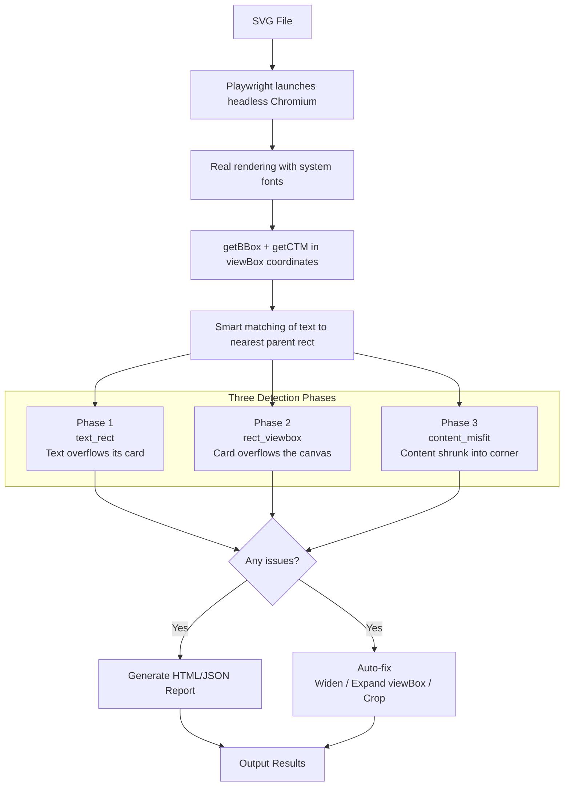

# 🛡️ svg-guard

**Automatically detect and fix text overflow in SVG diagrams**

> Designed for technical documentation, textbooks, flowcharts, architecture diagrams, and infographics.  
> No more manual coordinate tweaking or guessing text widths!

When SVGs use hardcoded absolute coordinates (common with draw.io, Figma, Visio, or hand-written SVGs), text frequently overflows card boundaries, gets clipped, or the entire graphic ends up "shrunk into a corner with lots of empty space."

This problem is especially painful with **CJK characters** (Chinese, Japanese, Korean) because rendered width varies significantly by font and platform.

**svg-guard** solves this by using **real browser rendering + precise measurement** instead of heuristics or string length estimation.

---

## ✨ Key Features

| Feature                    | Description                                      | Benefit for Beginners                  |
|---------------------------|--------------------------------------------------|----------------------------------------|
| **Real Browser Rendering**   | Uses Playwright + Chromium for accurate rendering | Results match exactly what users see   |
| **Three-Phase Detection**    | Catches text→rect, rect→viewBox, and content_misfit issues | Covers 95%+ of common overflow cases   |
| **Auto-Fix**                 | One-click: widen cards, expand viewBox, or smart-crop | No more manual parameter tuning        |
| **Beautiful Visual Reports** | Self-contained HTML with red highlight boxes + hover sync | Problems are instantly visible         |
| **CI Friendly**              | Non-zero exit code + JSON output                 | Easy integration with GitHub Actions   |
| **Safe Backups**             | Creates `.svg.bak` before any changes            | Safe to run even on important files    |
| **Python API**               | `check_svg`, `fix_svg`, `check_directory`        | Integrate into your own tools          |

---

## 🖼️ Before & After Comparison


*Left: Text overflowing the card boundary (clipped in real rendering)*  
*Right: svg-guard automatically widens the card so text fits perfectly*

---

## 🚀 Quick Start for Beginners (5 Minutes)

### Step 1: Install (one-time)

```bash
pip install svg-guard
playwright install chromium
```

> **Tip**: `playwright install chromium` downloads ~150MB browser engine (requires internet on first run).

### Step 2: Prepare Your SVG Files

Place your `.svg` files in a folder, for example:

```
my-project/
├── diagrams/
│   ├── architecture.svg
│   ├── flowchart.svg
│   └── user-flow.svg
└── ...
```

### Step 3: Check + Generate Report (Recommended First Step)

```bash
cd my-project
svg-guard check --dir ./diagrams --html report.html --verbose
```

After running, open `report.html` — you will see:


**Report Highlights**:
- Real rendered SVG on the left
- **Red semi-transparent boxes** precisely marking overflow areas and parent rects
- Right sidebar with issue list (hover to highlight corresponding red box)
- Light / Dark mode support

### Step 4: Auto-Fix

Once you're happy with the report:

```bash
svg-guard fix --dir ./diagrams
```

- All issues are automatically fixed
- Original files are backed up as `xxx.svg.bak`
- Want a dry run? Add `--dry-run`

---

## 🧠 How It Works (Visual Flow)


```mermaid
flowchart TD
    A[SVG File] --> B[Playwright launches headless Chromium]
    B --> C[Real rendering with system fonts]
    C --> D[getBBox + getCTM in viewBox coordinates]
    D --> E[Smart matching of text to nearest parent rect]
    
    subgraph Three Detection Phases
    F[Phase 1<br/>text_rect<br/>Text overflows its card]
    G[Phase 2<br/>rect_viewbox<br/>Card overflows the canvas]
    H[Phase 3<br/>content_misfit<br/>Content shrunk into corner]
    end
    
    E --> F & G & H
    F & G & H --> I{Any issues?}
    I -->|Yes| J[Generate HTML/JSON Report]
    I -->|Yes| K[Auto-fix<br/>Widen / Expand viewBox / Crop]
    J & K --> L[Output Results]
```

**Why real browser rendering is necessary**:

- Text width depends heavily on font, size, weight, letter-spacing, and browser engine
- CJK characters are especially unpredictable
- SVGs can contain nested transforms, `rotate`, nested `<svg>`, etc.
- Heuristic width estimation frequently misses or false-positives issues

svg-guard uses `getBBox()` + `getCTM()` in the **SVG's own user coordinate system** (viewBox space). Results are stable and viewport-independent.

---

## 🔍 Three Detection Phases Explained

### 1. Phase 1: `text_rect` — Text overflows its parent card (Most Common)

**Typical case**: Flowcharts or card-style architecture diagrams where Chinese/English titles are wider than the reserved `<rect>`.

**Detection logic**:
- Find the nearest parent `<rect>` for each `<text>`
- Compare actual text bounds against rect bounds (with configurable `pad`, `edge_pad`, `vpad`)
- If it exceeds the threshold → flag as `text_rect`

**Fix**: Automatically increase the rect's `width` / `height` (plus `fix_pad` breathing room)

> **Note**: A label wider than its card overflows **both** left and right — widening the rect to the text's right edge fixes the width problem, so this case IS auto-fixed; any remaining left/top component is reported in the issue's `fix.residual` field. Two cases are never auto-fixed and are skipped with a clear message: **pure left/top overflow** (widening only grows right/down, so it can never reach the text) and **transformed cards** (a rect with a `transform`, or inside a transformed `<g>` — its `width`/`height` live in pre-transform space, so editing them would not grow the rendered box; these carry `fixable=false` and must be edited manually).

### 2. Phase 2: `rect_viewbox` — The card itself overflows the SVG canvas

**Typical case**: A `<rect>`'s x/y/width/height values place it partially outside the `viewBox`, causing clipping.

**Fix**: Automatically expand the root `<svg>` `viewBox`, `width`, and `height`

### 3. Phase 3: `content_misfit` — "Content shrunk into a corner with lots of empty space" (Most Subtle)

**Typical case**:
- Many tools export SVGs with huge `viewBox` (e.g. `0 0 1920 1080`)
- Actual content occupies only ~10% of the area and sits in one corner
- The diagram looks tiny with massive empty space below/right

**Detection logic** (both conditions must be true):
- Content coverage < `coverage_threshold` (default 0.5) — coverage is the **sum of each element's own bbox area ÷ viewBox area** (true ink), not the area of the union bounding box, so a spread-out multi-card diagram isn't mis-measured as "full"
- Content centroid is offset from center by more than `center_offset_threshold`

**Fix**: Intelligently crop the `viewBox` tightly around the content (with `crop_pad` padding) so the graphic is centered and fills the frame nicely.

> **Pro tip**: To completely disable Phase 3, set `coverage_threshold=0`

---

## Real Example SVGs (Before & After)

### Example 1: `text_rect` — Long title overflows card

**Before (problematic):**

```svg
<svg xmlns="http://www.w3.org/2000/svg" viewBox="0 0 320 110" width="320" height="110">
  <!-- Card background -->
  <rect x="15" y="15" width="140" height="70" rx="10" ry="10"
        fill="#e0f2fe" stroke="#0369a1" stroke-width="2"/>
  
  <!-- Title that overflows in real rendering -->
  <text x="25" y="50" font-family="system-ui, sans-serif" font-size="17" 
        font-weight="600" fill="#0c4a6e">System Architecture Overview</text>
  
  <!-- Subtitle -->
  <text x="25" y="72" font-family="system-ui, sans-serif" font-size="13" 
        fill="#475569">Core Services &amp; Data Flow</text>
</svg>
```

**Problem**: The title "System Architecture Overview" is wider than the 140-unit card when rendered with real fonts.

**After (fixed by svg-guard)**:

The tool automatically widens the `<rect>` (and adds `fix_pad` breathing room):

```svg
<svg xmlns="http://www.w3.org/2000/svg" viewBox="0 0 320 110" width="320" height="110">
  <rect x="15" y="15" width="210" height="70" rx="10" ry="10"
        fill="#e0f2fe" stroke="#0369a1" stroke-width="2"/>
  
  <text x="25" y="50" font-family="system-ui, sans-serif" font-size="17" 
        font-weight="600" fill="#0c4a6e">System Architecture Overview</text>
  
  <text x="25" y="72" font-family="system-ui, sans-serif" font-size="13" 
        fill="#475569">Core Services &amp; Data Flow</text>
</svg>
```

---

### Example 2: `content_misfit` — Tiny content in huge viewBox

**Before**:

```svg
<svg xmlns="http://www.w3.org/2000/svg" viewBox="0 0 1200 800" width="1200" height="800">
  <!-- Huge empty canvas -->
  <rect x="0" y="0" width="1200" height="800" fill="#f8fafc"/>
  
  <!-- Small actual content in top-left corner -->
  <rect x="40" y="30" width="180" height="90" rx="8" fill="#bae6fd"/>
  <text x="55" y="65" font-family="system-ui" font-size="16" fill="#0c4a6e">Login Service</text>
  <text x="55" y="88" font-family="system-ui" font-size="12" fill="#475569">Auth Module</text>
</svg>
```

**Problem**: The diagram opens with a tiny box in the corner and ~90% empty space. Looks unprofessional.

**After (fixed)**:

svg-guard detects low coverage + high centroid offset and crops the viewBox:

```svg
<svg xmlns="http://www.w3.org/2000/svg" viewBox="20 10 220 130" width="220" height="130">
  <rect x="0" y="0" width="220" height="130" fill="#f8fafc"/>
  
  <rect x="20" y="20" width="180" height="90" rx="8" fill="#bae6fd"/>
  <text x="35" y="55" font-family="system-ui" font-size="16" fill="#0c4a6e">Login Service</text>
  <text x="35" y="78" font-family="system-ui" font-size="12" fill="#475569">Auth Module</text>
</svg>
```

Now the diagram is tight, centered, and professional.

---

## ⚙️ DetectionConfig Reference (Beginner-Friendly)

All measurements are in **SVG user units** (viewBox coordinate space), not CSS pixels.

| Parameter                  | Default   | Phase | Purpose                                      | Beginner Tip                          |
|---------------------------|-----------|-------|----------------------------------------------|---------------------------------------|
| `pad`                     | 3.0       | 1     | Base tolerance before flagging text overflow | Stricter → try 1.0–2.0                |
| `edge_pad`                | 4.0       | 1     | Extra tolerance on right/bottom edges        | Usually keep default                  |
| `vpad`                    | 2.0       | 1     | Vertical tolerance for descenders            | Usually keep default                  |
| `fix_pad`                 | 2.0       | 1     | Extra padding added during auto-fix          | Tighter look → try 1.0                |
| `min_rect_w` / `min_rect_h` | 80 / 40 | 1     | Ignore very small decorative rects           | Check small cards → lower to 30/20    |
| `vbox_fix_pad`            | 4.0       | 2     | Padding when expanding viewBox               | Usually keep default                  |
| `coverage_threshold`      | 0.5       | 3     | Flag if content covers less than this %      | More sensitive → try 0.3              |
| `center_offset_threshold` | 0.5       | 3     | Flag if content centroid is too far off-center | Usually keep default               |
| `bg_rect_ratio`           | 0.9       | 3     | Treat very large rects as background         | Usually keep default                  |
| `crop_pad`                | 8.0       | 3     | Padding around content when cropping         | Tighter crop → try 4.0                |
| `viewport_w` / `viewport_h` | 1600/1200 | render | Browser rendering viewport size           | Rarely needs changing                 |

**Custom config example**:

```python
from svg_guard import DetectionConfig, BrowserRunner, check_directory

cfg = DetectionConfig(
    pad=1.5,
    min_rect_w=40,
    min_rect_h=30,
    coverage_threshold=0.35,
)

with BrowserRunner(cfg) as runner:
    results, total = check_directory("./diagrams", runner=runner)
```

---

## 🖥️ CLI Commands

### `svg-guard check`

```bash
svg-guard check --dir ./diagrams --verbose --html report.html --json results.json
```

| Flag          | Default | Description                              |
|---------------|---------|------------------------------------------|
| `--dir`       | `.`     | Directory containing SVGs                |
| `--verbose`   | off     | Show per-file details                    |
| `--html FILE` | —       | Generate self-contained visual HTML report |
| `--json FILE` | —       | Generate structured JSON report          |

Exit code: `0` = clean, `1` = issues found (great for CI)

### `svg-guard fix`

```bash
svg-guard fix --dir ./diagrams --dry-run   # Preview only
svg-guard fix --dir ./diagrams             # Apply fixes + backup
```

The summary counts honestly: `Applied 3 fix(es); 2 issue(s) skipped as not auto-fixable (manual edit needed)`. Skips (render errors, transformed cards, pure left/top overflow) are listed per-file with `[skip]` and never counted as fixes.

### `svg-guard report`

One-command report generation:

```bash
svg-guard report --dir ./diagrams --output my-report.html
```

---

## 🐍 Python API Examples

### Basic usage

```python
from pathlib import Path
from svg_guard import BrowserRunner, check_svg, fix_svg

with BrowserRunner() as runner:
    result = check_svg(runner.page, Path("diagrams/arch.svg"))
    
    if result.ok:
        print("✅ No issues found")
    else:
        print(f"❌ Found {len(result.issues)} issues")
        changes = fix_svg(Path("diagrams/arch.svg"), result.issues)
        for change in changes:
            print(f"  Fixed: {change}")
```

### Batch processing (reuse browser for speed)

```python
from svg_guard import check_directory

with BrowserRunner() as runner:
    for folder in ["./diagrams", "./icons"]:
        results, total = check_directory(folder, runner=runner)
        print(f"{folder}: {total} files processed")
```

---

## 🧩 CI/CD Example (GitHub Actions)

```yaml
name: SVG Guard Check
on: [push, pull_request]

jobs:
  check:
    runs-on: ubuntu-latest
    steps:
      - uses: actions/checkout@v4
      - uses: actions/setup-python@v5
        with:
          python-version: "3.11"
      - name: Install dependencies
        run: |
          pip install svg-guard
          playwright install chromium
          sudo apt-get update && sudo apt-get install -y fonts-noto-cjk
      - name: Run svg-guard
        run: svg-guard check --dir ./docs/images --html report.html
      - name: Upload report
        uses: actions/upload-artifact@v4
        if: always()
        with:
          name: svg-guard-report
          path: report.html
```

> **Important**: CI environments usually lack CJK fonts. Always install them for accurate Chinese/Japanese/Korean detection.

---

## ❓ FAQ

**Q: Chinese characters show as boxes or garbled in reports?**  
A: The environment is missing CJK fonts. Install `fonts-noto-cjk` or `fonts-wqy-zenhei`.

**Q: Can I ignore specific SVG files?**  
A: Currently filter by directory structure or script. `.svgguardignore` support is planned.

**Q: Does it support `<defs>`, `<use>`, complex transforms?**  
A: Yes — real `getCTM()` accumulates all transformations.

**Q: Will fixes mess up my SVG formatting?**  
A: No — the tool preserves original indentation and attribute order as much as possible.

**Q: Can I detect without fixing?**  
A: Yes — use `check` or `fix --dry-run`.

**Q: What happens to broken/malformed SVG files?**  
A: They are reported as **render errors**, never as clean passes. A file the browser can't parse as SVG makes `check` exit with code 2, and the JSON report carries an `"error"` field for it — so CI never goes green on a corrupt file.

**Q: Detection is slow?**  
A: First Chromium launch is slow. Reuse the same `BrowserRunner()` instance for batch processing.

---

## 📚 Advanced Tips

1. **First time users**: Always run `check --html report.html` first, review the visual report, then run `fix`.
2. **Team workflow**: Add `svg-guard check` to pre-commit hooks or required CI checks.
3. **Tuning**: Adjust `pad` and `min_rect_*` based on your project's style to avoid over- or under-reporting.
4. **Contribute examples**: Submit real (anonymized) overflowing SVGs from your projects to help improve detection.

---

## 🤝 Contributing

- Open an Issue with your SVG scenario + screenshot
- Submit PRs for better detection logic, new phases, or report UI improvements
- Star the repo if this tool helps you!

---

## 📄 License

MIT License

---

**Make every SVG crisp, professional, and overflow-free!**  
svg-guard — Your SVG Quality Guardian 🛡️

> This is an enhanced version with illustrations, Mermaid diagrams, beginner-friendly steps, detailed parameter explanations, and real before/after SVG examples.